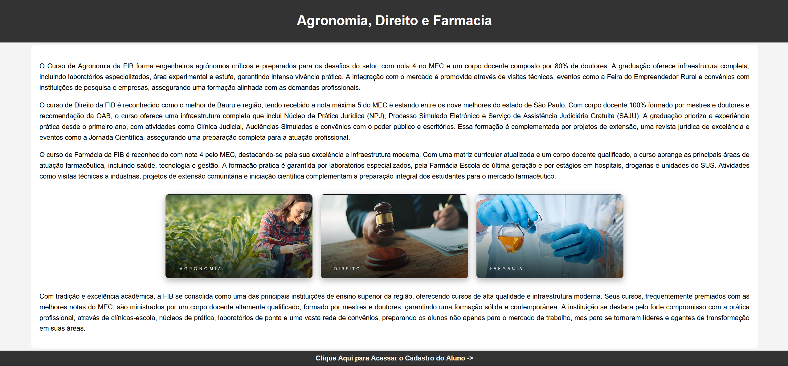
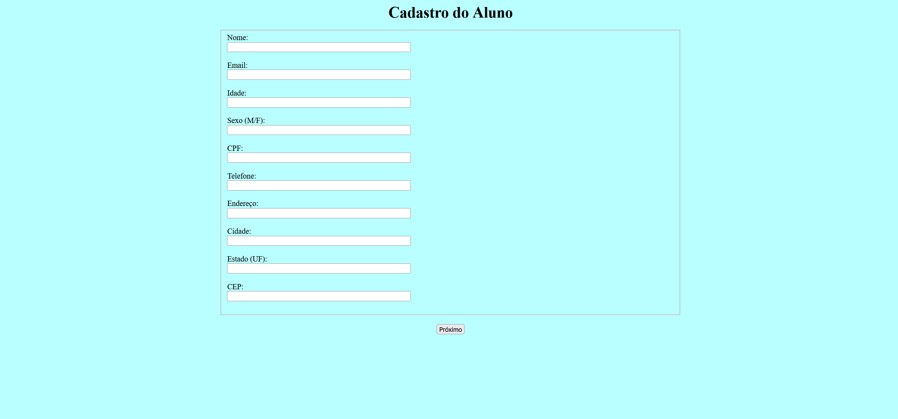
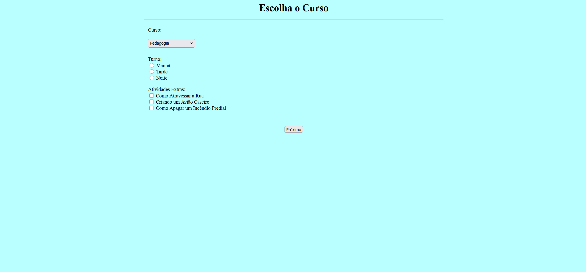
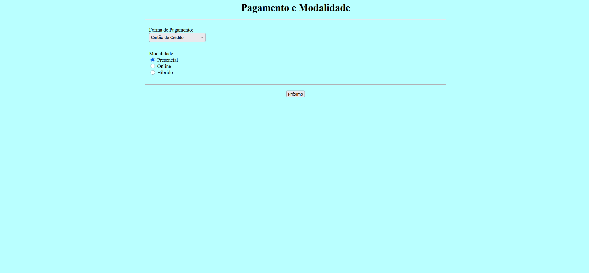
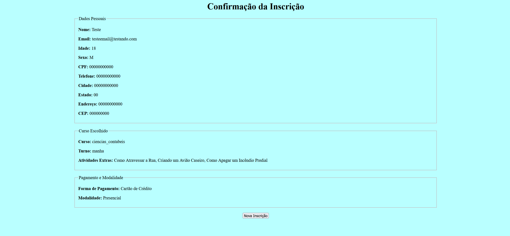

# 📝 Formulário de Inscrição em Etapas [PHP]

> Este projeto foi desenvolvido em grupo como um trabalho avaliativo de bimestre, com o objetivo de consolidar os conhecimentos em PHP e HTML aprendidos em aula.

---

### 🧠 Sobre o Projeto
O projeto consiste em um sistema de cadastro de aluno dividido em três etapas sequenciais, culminando em uma página de confirmação. A principal característica técnica é o uso de **Sessões PHP** para gerenciar e persistir os dados do usuário entre as diferentes páginas, garantindo uma experiência de usuário contínua sem a necessidade de um banco de dados.

---

### 🌟 Destaques do Projeto

#### 🧩 Funcionalidades:

**Etapas 🔢 | Sessões 💾 | Validação ✔️ | Confirmação 📄**

* **Fluxo de Múltiplas Etapas:** O cadastro é dividido em 3 fases (Dados Pessoais, Curso e Pagamento) para organizar a coleta de informações.
* **Persistência com Sessões PHP:** Utiliza `$_SESSION` para manter os dados do usuário ativos durante toda a navegação entre as páginas.
* **Validação de Dados:** Validação no lado do servidor em cada etapa para garantir que os campos essenciais sejam preenchidos.
* **Retenção de Dados:** Os formulários repopulam os campos com os dados já inseridos em caso de erro de validação.
* **Página de Confirmação Final:** Ao final do processo, uma página de resumo exibe todas as informações fornecidas pelo usuário.
* **Estrutura Simples:** O código é focado na lógica de back-end com HTML puro, sem dependências externas como CSS complexo ou JavaScript.

---

### 💻 Tecnologias Utilizadas

* 🐘 **PHP:** Para toda a lógica de back-end, validação dos formulários e gerenciamento de sessões.
* 📜 **HTML:** Para a estrutura de todas as páginas e campos do formulário.

---

### 📂 Estrutura dos Arquivos

-   `Etapa - 1.php`: Coleta de dados pessoais.
-   `Etapa - 2.php`: Coleta de preferências do curso.
-   `Etapa - 3.php`: Coleta de dados de pagamento.
-   `Finalização.php`: Exibição de todos os dados.

---

## 📸 Prints do projeto

### Tela Inicial

### Iniciando o Cadastro - Etapa 1

### Escolhendo as Atividades - Etapa 2

### Escolhendo a forma de pagamento - Etapa 3

### Resultado Final

---
